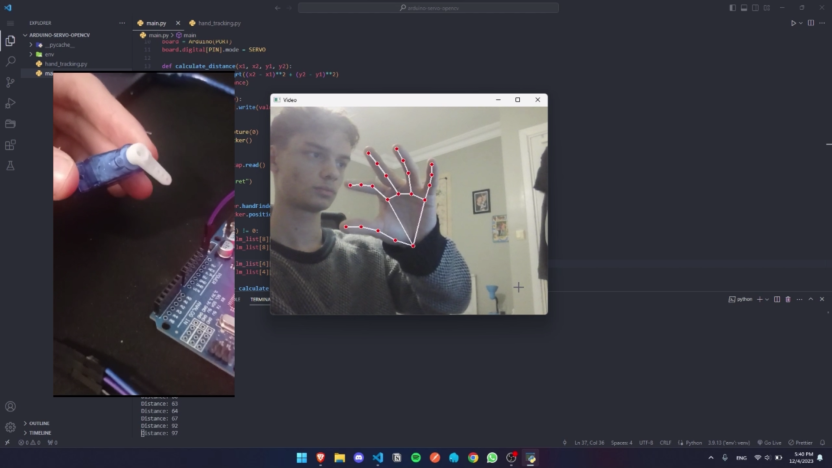

# Arduino Servo Motor Controlling With Hand Tracking



This project uses Mediapipe for hand tracking with a custom Python module and OpenCV for video capture to enable hand-controlled movement of a servo motor. The device detects hand motions and monitors the user's hand movement, adjusting the servo motor's position accordingly. The project offers an interactive and captivating experience by showcasing the combination of hardware control and computer vision capabilities.

## Project Components

The project consists of the following components:

1. **main.py**: This file contains the main code for capturing video, hand tracking, and controlling the servo motor based on the detected hand gestures.
2. **hand_tracking.py**: This file defines the HandTracker class, which utilizes the Mediapipe library to perform hand tracking and landmark detection.

## Requirements

- Python 3.7 - 3.9 (higher versions don't work with this Mediapipe code)
- OpenCV library
- Mediapipe library
- Pyfirmata library

## Usage

1. Clone or download this repository to your local machine.

2. Create a virtual envoirment (optional but recommended):
```
Linux
$ python3 -m venv env
$ source env/bin/activate

Windows
> python -m venv env
> env\scripts\activate
```

3. Install the required libraries using pip:
```
$ pip install -r requirements.txt
```

4. Ensure that the Arduino board is porperly connected to the computer (edit the **`PORT`** and **`PIN`** variables in the **`main.py`** to make it suitable for your own project).

5. Run the **`main.py`** script:
```
$ python3 ./main.py
```
6. A window will open displaying the video feed with the overlaid hand landmarks.

7. Move your hand in front of the camera to control the servo motor.

## Code Overview

main.py

```python
import cv2
import math
from pyfirmata import Arduino, SERVO
from hand_tracking import HandTracker

#... (code for setting up Arduino, defining functions, and main loop)
```

hand_tracking.py

```python
import cv2
import mediapipe as mp

class HandTracker():
    #... (code for hand tracking and landmark detection)
```

After setting up the Arduino board and recording video from the camera the **`main.py`** mesuars the distance between the thumb and index finger using the **`HandTracker`** class. The servo motor is then controlled by this measured distance.

## Operation

1. The **`main.py`** script initializes the Arduino board and the video capture device.
2. Inside the main loop, it captures a frame from the video feed and uses the **`HandTracker`** class to detect the distance between user's thumb and index finger.
3. After formatting it to fit the servo motor, the script modifies the servo motor's position based on the distance that was detected.
4. The updated video feed, along with the overlaid hand landmarks, is displayed in a window.
5. The loop continues until the user exits the program.

## Customization

Feel free to customize the project to suit your specific requirements. You can modify the hand gestures and their corresponding actions, adjust the servo motor's range of motion, or integrate additional hardware components to create a more complex interactive system.

## Showcase

This project demonstrates the potential of hand-controlled hardware systems and gain valuable experience in the fields of computer vision, hardware integration, and human-computer interaction.
